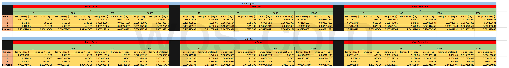

# Conclusion General de la Tarea
---
En ambos ordenamientos se puede ver una clara diferencia con el metodo sort de la listas de python que viene por defecto, ya que en todos los promedios en los casos con diferentes tamanios cada uno los tiempos son menores que a los de este. Pero esto no quiera decir que sean mejores que ese, ya que tienes una mayor velocidad al ordenar pero un mal gaste horrible de memoria, debidoa a la naturaleza de ambos ya que Counting necesita de listas alternas de tamanio de maximo elemento de la lista para poder funcionar, y aunque tengamos una lista de 10 pero hay un elemento de valor 10000 se desperdicia mucha memoria. Mientras que Radix Sort tiene otro problema de memoria debido a la cantidad de listas que ocupa para poder guardar segun los digitos. Solo podemos decir que Radix llega a ser mas rapido en general que Counting y optimiza mejor memoria que este pero eso no quita que ambos son unos pesimos algoritmos de ordenamiento, hablando de manejo de memoria.  

---
### Tabla de tiempos
