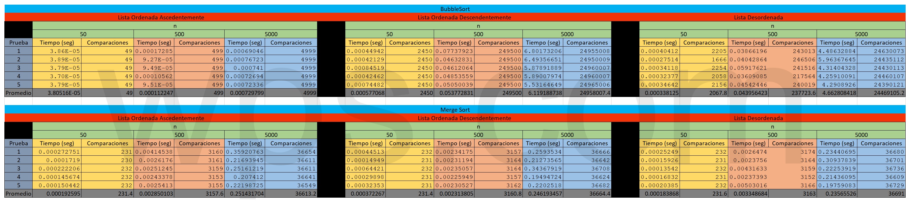

# Conclusion General de la Tarea
---
En resumen BubbleSort aun con la optimizacion llega a ser muy inficiente al ordenar grandes conjuntos de datos, esto se puede apreciar tanto en los promedios de tiempo como en las comparaciones de cada uno en los diferentes conjuntos con cantidad y ordenamiento diferentes, donde cerca de pocos elementos en este caso 50 las comparaciones y promedios de tiempos son similares, incluso puede llegar a ser mejor el de BubbleSort, pero en los onjuntos mas grandes (5000), la diferencia este notable en la eficiencia que llega a tener MergeSort dobre BubbleSort. 

Otra prueba son las graficas, ya que aunque se parecen, la escala es diferente en cada una y si se coparan estas, es mas notorio lo anterior.

---
### Tabla de tiempos
