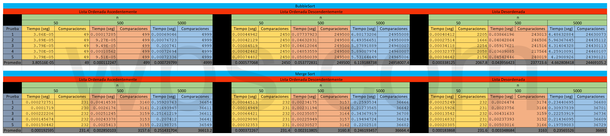

#### [Regresar](../../README.md)
# Especificaciones de la Tarea
### Comparacion de [BubbleSort (Optimizado)](BubbleSortOpt.py) y [MergeSort](MergeSort.py)
Se deben programar los algoritmos de ordenamiento BubbleSort (Optimizado) y MergeSort para obtener los tiempos de ejecucion para las listas de enteros de diferentes tamanios (n):

- 50
- 500
- 5000

Realizar minimo de 5 veces para cada tamanio y para cada caso:

- Mejor Caso (Lista Ordenada Ascendentemente).
- Peor Caso (Lista Ordenada Descendentemente).
- Caso Promedio (Lista Aleatoria).

Para obtener el promedio y generar una conclusion al comparar dichos algoritmos.

**Notas**: 

- Se tiene tanto la tabla de los tiempos en PDF y Excel.
- En la carpeta Graficas, se tienen las graficas de comparacion de tiempos entre los algoritmos para cada caso y cada tamanio, ademas de contener el codigo en Python para graficar los datos.

---
## Conclusion General
En resumen BubbleSort aun con la optimizacion llega a ser muy ineficiente al ordenar grandes conjuntos de datos, esto se puede apreciar tanto en los promedios de tiempo como en las comparaciones de cada uno en los diferentes conjuntos con cantidad y ordenamiento diferentes, donde cerca de pocos elementos en este caso 50 las comparaciones y promedios de tiempos son similares, incluso puede llegar a ser mejor el de BubbleSort, pero en los onjuntos mas grandes (5000), la diferencia este notable en la eficiencia que llega a tener MergeSort dobre BubbleSort. 

Otra prueba son las graficas, ya que aunque se parecen, la escala es diferente en cada una y si se coparan estas, es mas notorio lo anterior.

---
### Tabla de tiempos

