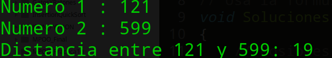
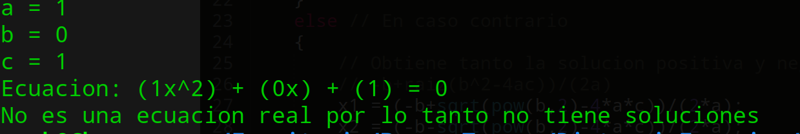

#### [Regresar](../../README.md)
# Especificaciones de la Tarea
### [Distancia entre Digitos](./CodigoFuente/Distancia.cpp)
Para este programa se solicito que el usuario de dos numeros de la misma cantidad de digitos, donde para calcular la distancia entre ellos, es mediante una sumatoria de los valores absolutos de la diferencia entre cada digitos de los dos numeros. Ejemplo:

- 234 y 489 su distancia es 12
    + Debido a que |2-4| + |3-8| + |4-9| = 2+5+5 = 12

### [Solucion de una Ecuacion de segundo orden](./CodigoFuente/Ecuacion.cpp)
En este programa el usuario debe proporcionar los valores de a,b y c de una ecuacion cuadratica y el programa debe mostrar sus dos soluciones, una solucion o sin solucion (segun sea el caso). Ejemplo:

- a = 1, b = 0, c = -1
    + X^2 -1 = 0 tiene dos soluciones 
        * x1 = 1
        * x2 = -1

---
## Screenshot del funcionamiento de Distancia de Digitos

---
## Screenshot del funcionamiento de Solucion de una Ecuacion de segundo orden
