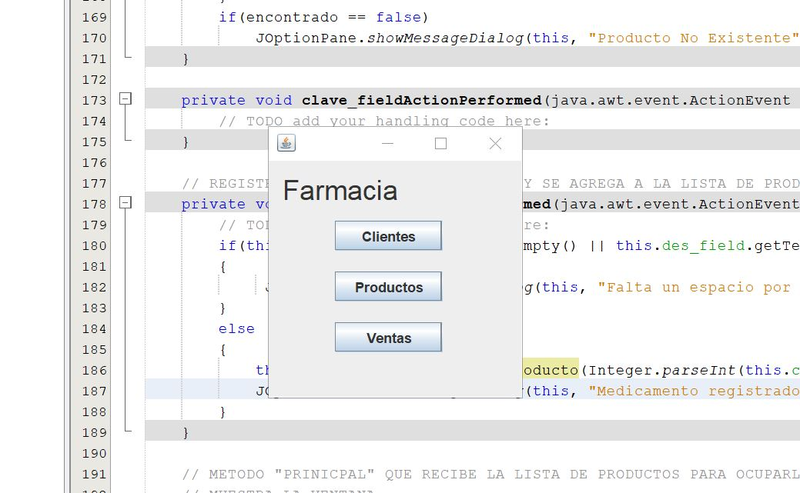
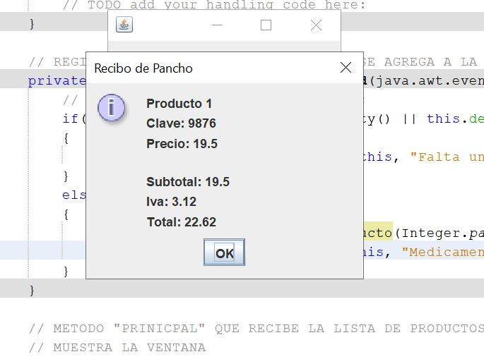

#### [Regresar](../../README.md)
# Especificaciones de la Tarea
### [Farmacia](./Farmacia)
Se pide un un sistema de una farmacia donde pueda registrar tanto clientes como productos (medicamentos) y que a su vez dado esos registros, un cliente registrado pueda comprar tanto productos como quiera mientras haya existencia, para al final de la compra se le pueda dar un resumen detallado de todo lo que adquirio.

**Notas**: 

- Se solicito que este programa manejara listas genericas con Java 11 por lo que a la hora del casteo puede marcar error si se ocupa una version anterior.
- Se ocupo Netbeans 11 para realizar este programa.

---
## Algunas Screenshots de su funcionamiento

---

---

---

---

