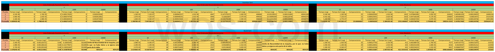

# Especificaciones de la Tarea
### Comparacion de InsertionSort y QuickSort
Se deben programar los algoritmos de ordenamiento InsertionSort y QuickSort para obtener los tiempos de ejecucion para las listas de enteros de diferentes tamanios (n):

- 10
- 100
- 1000
- 10000

Realizar minimo de 3 veces para cada tamanio y para cada caso:

- Mejor Caso (Lista Ordenada Ascedentemente).
- Peor Caso (Lista Ordenada Descendentemente).
- Caso Promedio (Lista Aleatoria).

Para obtener el promedio y generar una conclusion al comparar dichos algoritmos.

**Notas**: 

- Se tiene tanto la tabla de los tiempos en PDF y Excel.
- En la carpeta Graficas, se tienen las graficas de comparacion de tiempos entre los algoritmos para cada caso y cada tamanio, ademas de contener el codigo en Python para graficar los datos.

---
# Conclusion General
En General Quick sort es mas rapido e eficiente que Insertion Sort ya que en la mayoria si no por decir todos las pruebas tardo menos tiempo y las comparaciones fueron mucho menor, y eso se debe a la recursividad de Quick Sort aunque eso fue lo que lo condeno con la lista de 10000 ya que se necesita una maquina potente y con gran capacidad en RAM y procesador para operar con una gran cantidad de numeros ya que puede alcanzar el limite de recurisivada de la maquina y ya no poder acabar, como fue en el caso de la listas ordenadas Descendentemente y Ascendentemente.  

---
### Tabla de tiempos
