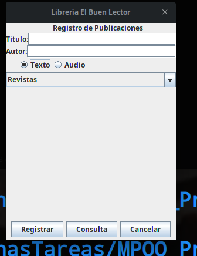
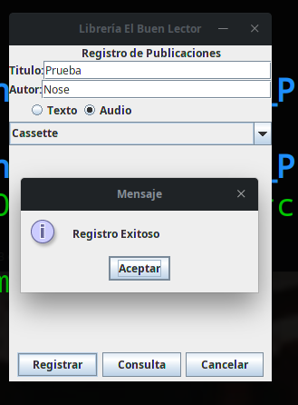
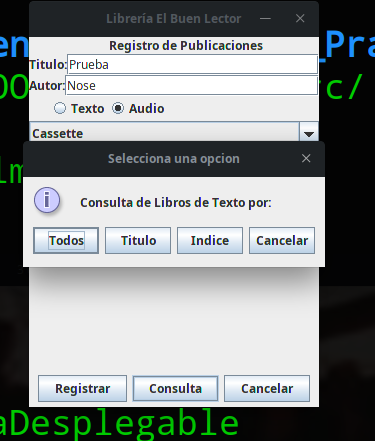
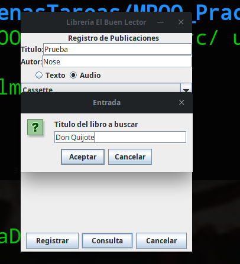
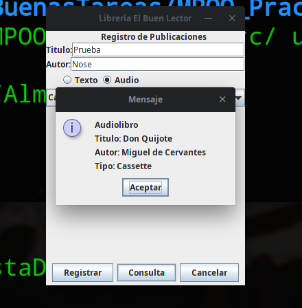

# Especificaciones de la Tarea
### Libreria
---
Una aclaracion antes de mencionar las especificaciones, es que este codigo es el resultado de la realizacion de las practicas 10 y 12 de un profesor que imparte la asignatura Programacion Orientada a Objetos (POO), donde cada una de sus practicas consiste en ir agregando funcionalidades a un codigo "principal" el cual es un sistema de registro y consulta de libros o audiolibros de una libreria.
**Cabe destacar que el profesor proporciono el codigo de la libreria por lo cual el unico codigo original de mi persona es el que se solicito en cada practica.**

---
#### Practica 10 (Requisitos)
Para la practica 10 se pidio:

- La compilacion y ejecucion del codigo para su analisis.
- Modificar el comportamiento de los JRadioButton para que se seleccionaran uno a la vez y segun el que se seleccione muestra su lista correspondiente.
- Modificar la clase Administrador para que pueda registrar archivos separando los elementos de tipo texto y tipo audio. 

#### Practica 12 (Requisitos)
Para la practica 12 se pidio:

- La compilacion y ejecucion del codigo para su analisis, para agregar nuevas clases por cada tipo de resgistro (texto y audio).
- Modificar el codigo para que el registro se ejecute separando la informacion de acuerdo al tipo de registro.
- Modificar el codigo para que pueda leer la informacion de un archivo de acuerdo al indice y al tipo de registro solicitado.

**Notas**:

- Los reporte de cada practica, de lo que se modifico esta en el archivo [Reporte](Reporte.md).
- Para la compilacion y ejecucion en Linux desde terminal es:
    + javac ./unam/fi/mpoo/aplicacion/Libreria.java 
    + java -cp /home/gock/Escritorio/BuenasTareas/MPOO_Practica10/src/unam.fi.mpoo.aplicacion.Libreria
- Para la compilacion y ejecucion en Linux desde terminal es:
    + javac .\unam\fi\mpoo\aplicacion\Libreria.java
    + java -cp C:\Users\Usuario\Escritorio\MPOO_Practica10\src\ unam.fi.mpoo.aplicacion.Libreria
---
## Algunas Screenshots de su funcionamiento

---

---

---

---
