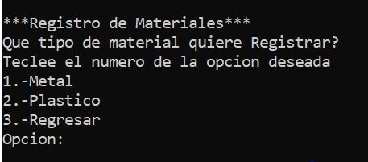
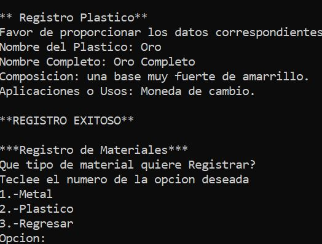
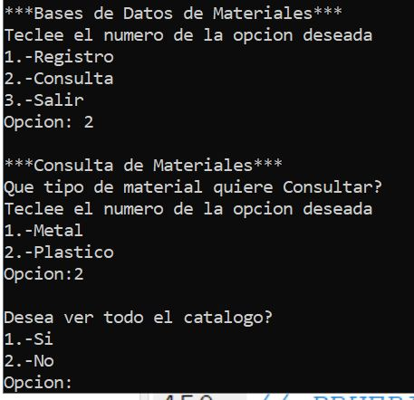

#### [Regresar](../../README.md)
# Especificaciones de la Tarea
### [Materiales](./Codigo Fuente)
Registro de materiales plasticos y metales, donde para cada uno se puede tanto registrar como consultar. La infomacion de los materiales que se necesitan para registrar y que se muestran en la consulta son:

- Metales:
    + Nombre.
    + Coeficiente de temperatura.
    + Resistividad.
    + Mejor Aleacion.
    + Tipos/Composicion.
    + Aplicaciones.
- Plasticos:
    + Nombre Corto.
    + Nombre Completo.
    + Propiedades.
    + Usos.

**Notas**: 

- Para cada material se hizo su propia biblioteca con sus respectivas funciones.
- La carpeta [Materiales](./Materiales) contiene el programa en un proyecto de DevC.

---
## Algunas Screenshots de su funcionamiento

---

---

