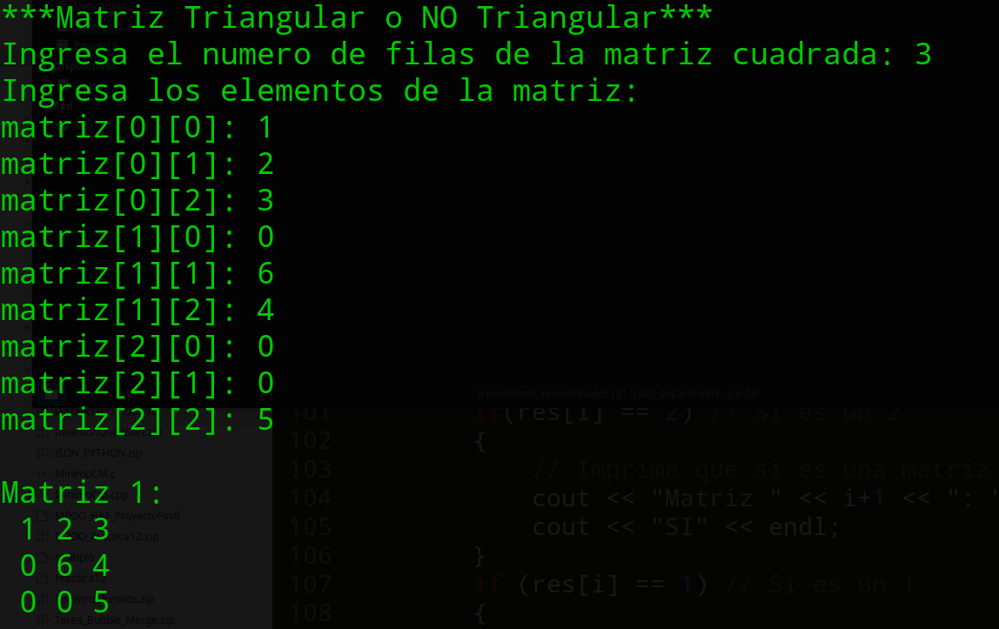
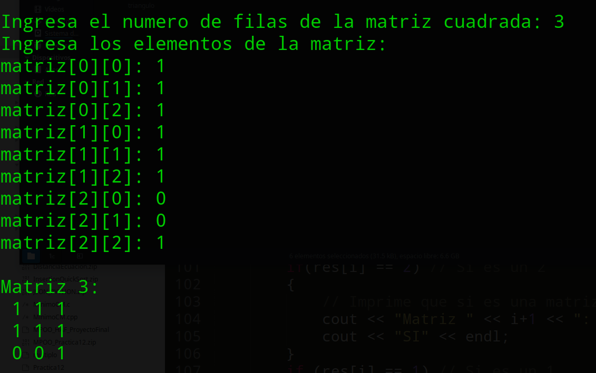
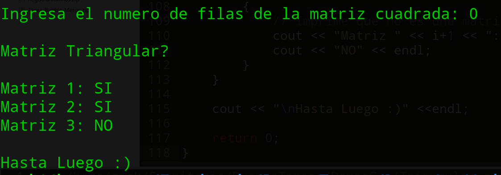

#### [Regresar](../../README.md)
# Especificaciones de la Tarea
### [Matriz Triangular o No Triangular](./CodigoFuente/Triangular.cpp)
El programa verifica si las matrices cuadradas ingresadas son trinagulares o no, para que una matriz sea triangular los numeros arriba o abajo de la diagonal deben ser ceros. La logica del programa es la siguiente:

- Se solicita el tamanio n de su matriz cuadrada (nxn).
    + Si es mayor a cero y menor a 50, pasa a pedir cada dato de la matriz.
        * Luego verifica si es triangular la matriz, y guarda la respuesta en un vector.
    + Si es igual a cero acaba el programa y muestra cuales de todas las matrices son triangulares o no dado las respuestas guardadas.

---
## Algunas Screenshots de su funcionamiento

---

---
