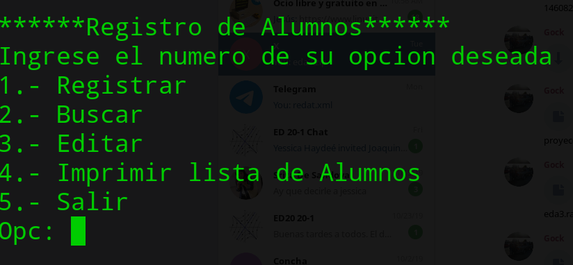
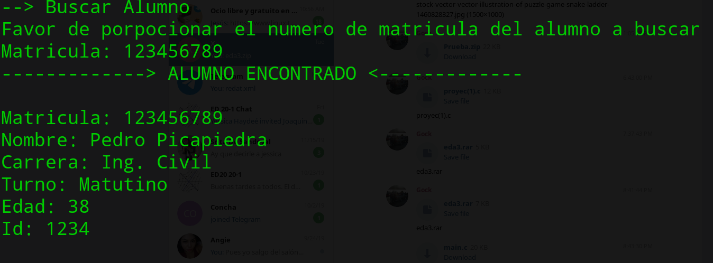
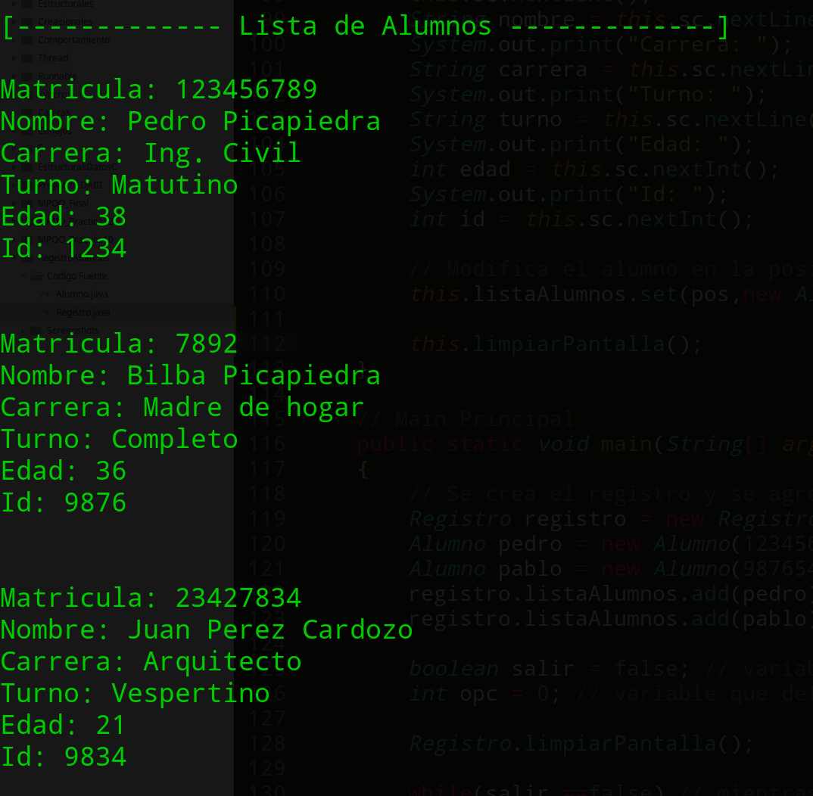

# Especificaciones de la Tarea
### Registro de Alumnos
Para una universidad se pidio un sistema donde se pueda registrar y consultar sus alumnos inscritos en ella. Donde la informacion de cada alumno es la siguiente:

- Matricula.
- Nombre Completo.
- Carrera.
- Turno.
- Edad.
- ID.

Donde el usuario puede registrar un alumno, buscar un alumno por su matricula, modificar los datos de un alumno y mostrar todos los registros.

**Nota**: Falta el eliminar el alumno ya que no se solicito eso en las especificaciones, en caso de implementarlo, se realiza la busqueda por matricula y en caso de existir, eliminarlo de la lista por medio del indice de donde se ubica.

---
## Algunas Screenshots de su funcionamiento

---

---

