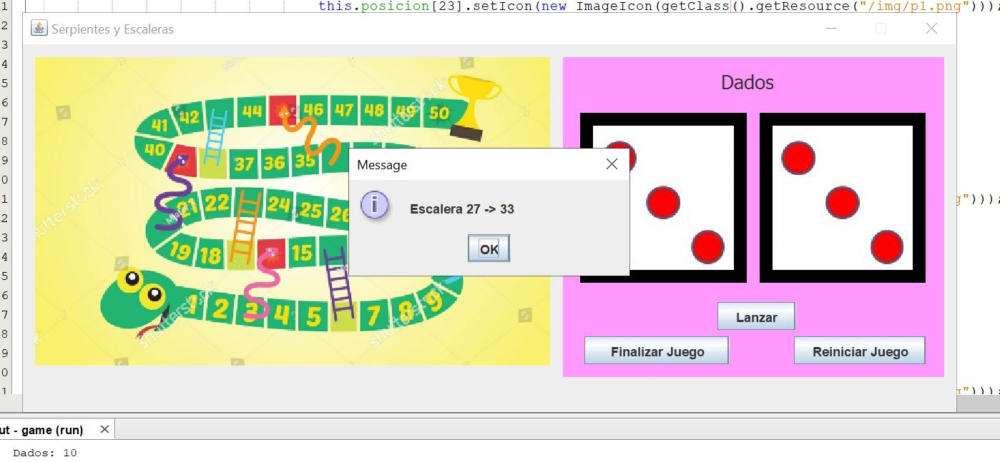

#### [Regresar](../../README.md)
# Especificaciones de la Tarea
### [Serpientes y Escaleras](./game)
Se pidio el juego de Serpientes y Escaleras con GUI, donde los puntos extraordinarios a tratar fueron:

- Maximo de dos jugadores.
- El uso de una matriz de 5x10 de booleanos que representa el tablero.
- Minimo 3 serpientes y 3 escaleras.
- Que se muestra una "animacion" a la hora de lanzar los dados.
- Contar con un boton para reiniciar el juego en cualquier momento.
- Contar con un boton que finaliza el juego en cualquier momento.

**Notas**: 

- Este juego aun se puede mejorar muchisimo, ya que por mala organizacion del cliente y cambiar fechas de ultimo momento, se trabajo contra reloj para entregar un codigo mas funcional que optimo.
- Se uso Java 11 y Netbeans 11.

---
## Algunas Screenshots de su funcionamiento

---
 

---

---
  

---
 

