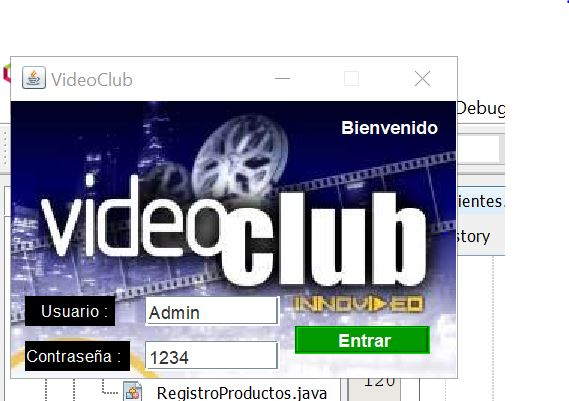
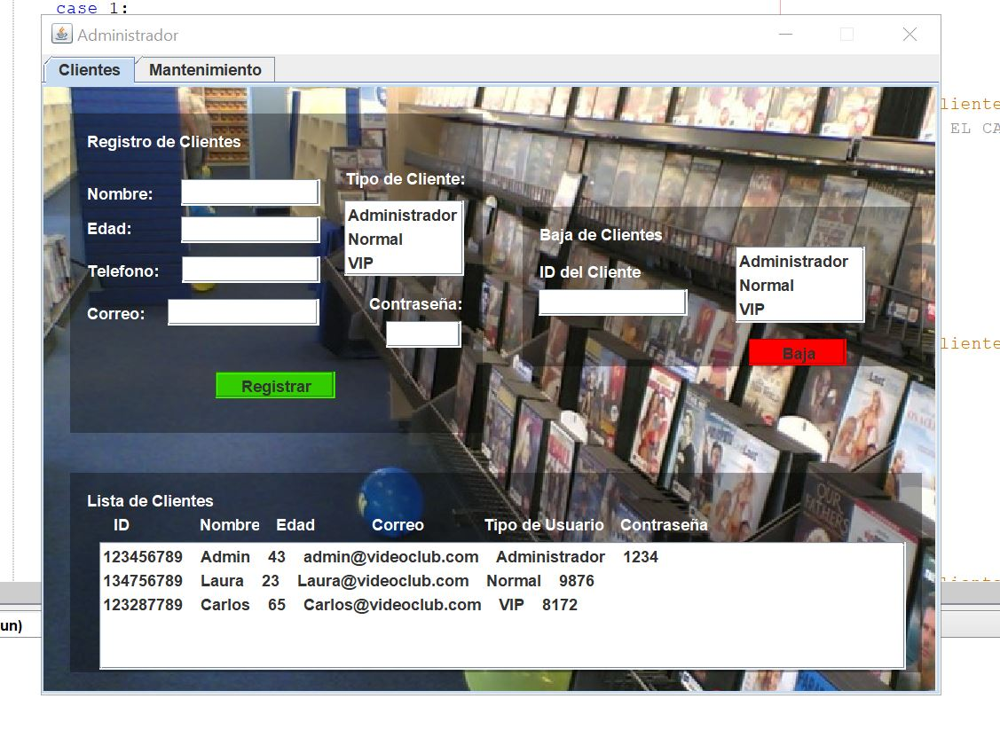
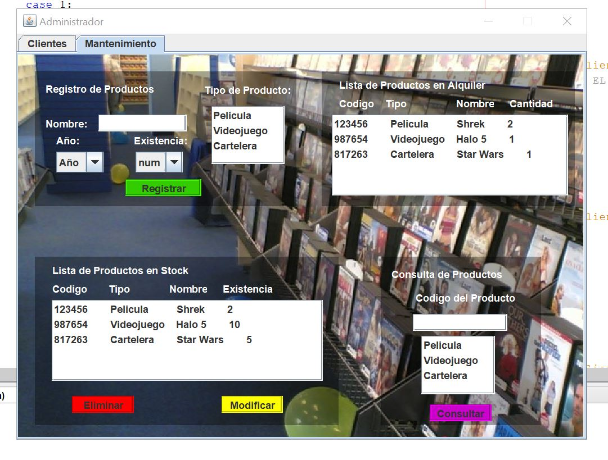
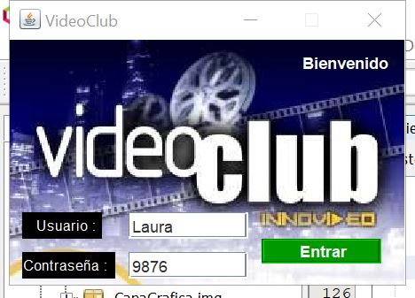
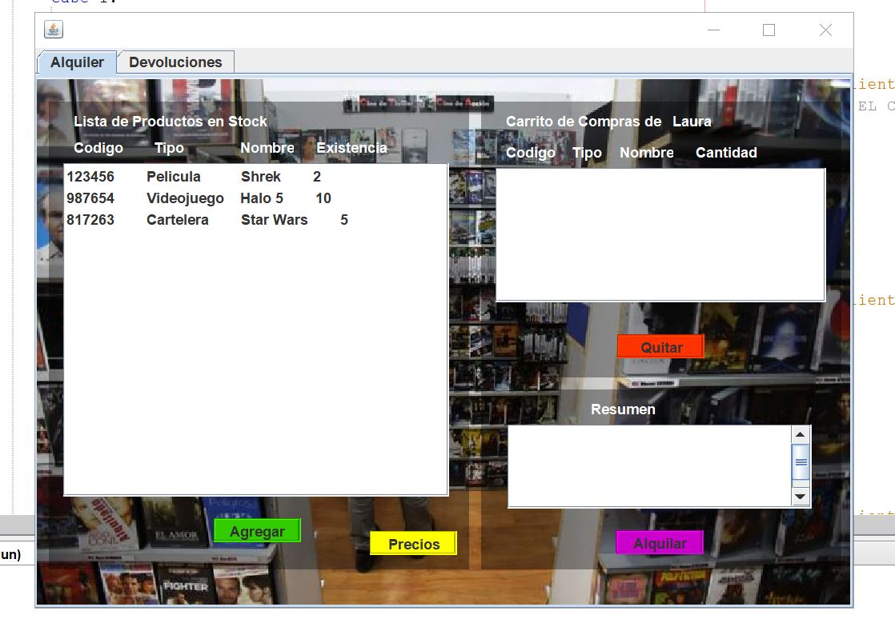
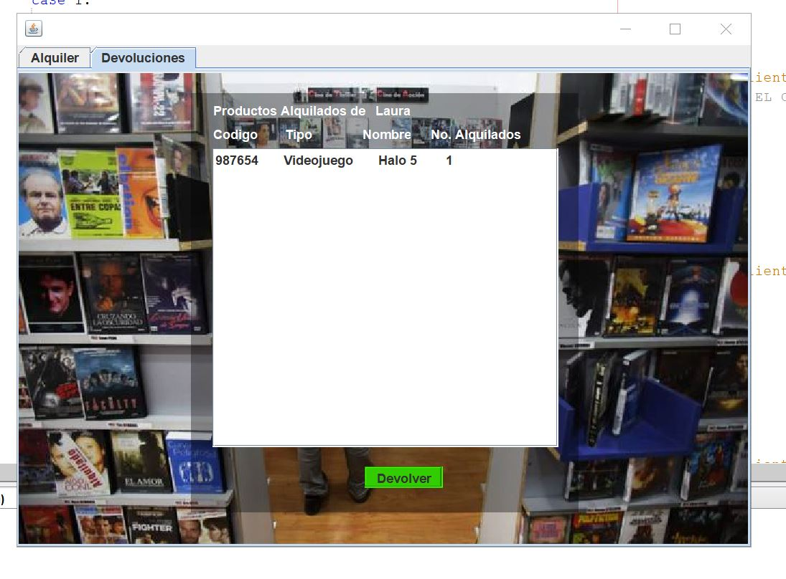

#### [Regresar](../../README.md)
# Especficaciones de la Tarea
### Video Club
El proyecto consiste en realizar un sistema para el Alquiler de ejemplares (películas,documentales, fábulas) de un Video Club, que permita:

- Mostrar al cliente un detalle del alquiler realizado con el respectivo monto a pagar.
- Dar mantenimiento a los ejemplares.
- Realizar devoluciones de ejemplares
 
#### Modelo de Clases sugerido
1. El sistema tendrá control en cuanto al acceso, hay un tipo de usuario:
    - Administrador
2. El Video Club diferencia a sus clientes en 2 categorías: VIP y regulares. 
    - Dependiendo del tipo solicita información respectiva. Si el cliente es Regular y esCiudadano de Oro, le aplicará un 10% de descuento sobre el total a pagar por su alquiler. Y si es VIP, se le aplica un 15% de descuento.
3. De cada Ejemplar se almacena: su nombre, año de creación, existencias.
4. Las categorías de los ejemplares pueden ser (se guarda código y descripción):
    - Cartelera
    - Película
    - Video Juego
5. Cada Alquiler se emite a nombre de un Cliente.
6. Los alquileres se pueden pagar con efectivo o con tarjeta de crédito. Si se paga decontado se aceptan pagos en dólares. Si se paga con tarjeta de crédito se debe realizar lo siguiente:
    - Se solicita al usuario sus datos: Nombre del cliente, tipo de tarjeta(solo se aceptan Vísa o Master Card) fecha de vencimiento (mes y año) número de tarjeta y código de seguridad de la tarjeta.
    - Se debe revisar que la fecha de vencimiento de la tarjeta sea posterior a la fecha actual y que el código de seguridad sea un número de 3 dígitos.
7. Se contará con una opción que permita realizar la devolución de ejemplares.
8. El sistema debe permitir ver los Alquileres de un cliente

#### Requerimientos Técnicos
1. El programa debe estar estructurado en 3 capas:
    - Capa Vista o capa gráfica: Diseño de pantallas a través de las cuales se comunicará con el usuario.
    - Capa de Lógica de Negocios: Diseño de las clases y sus relaciones.
    - Capa de Acceso a datos: Diseño de la(s) clases que dan persistencia a los objetos. El mismo será manejado con archivos.
2. La aplicación debe contar con una pantalla de control de acceso, donde el usuario digita su nombre y contraseña.
3. La aplicación debe presentar una pantalla principal en la que el usuario por mediode un menú pueda acceder a las diferentes funcionalidades de la aplicación (Mantenimiento de ejemplares, Alquiler), dependiendo del tipo de usuario.
4. Mantenimiento de Ejemplares: Debe diseñarse una pantalla en la que el usuario pueda dar mantenimiento a los ejemplares que posee el VideoClub. La lista de ejemplares se almacenará en un archivo. En esta pantalla de mantenimiento se debe permitir al usuario (Administrador):
    - Insertar un nuevo ejemplar (el código de ejemplar debe generarse
automáticamente).
    - Consultar la información de un ejemplar.
    - Modificar la información de un ejemplar (excepto el código).
    - Eliminar totalmente un ejemplar.
5. Pantalla de Alquiler: Es la pantalla en la que el usuario digita la información del alquiler que se está efectuando.
    - El número de alquiler debe generarse automáticamente.
    - La fecha de la Orden o Alquiler se obtendrá a partir de la fecha del sistema operativo.
    - Si es lunes, se aplica un 50% de descuento, sobre el monto total del Alquiler.
    - El Alquiler debe llevar los datos del cliente. Dependiendo del tipo de cliente (VIP o Regular) se deben digitar los datos que correspondan.
    - Si el cliente es Regular y es Ciudadano de Oro, el vendedor debe contar
con un objeto gráfico como un checkBox en el que pueda indicar dicha condición,
en este caso el alquiler tendrá un descuento del 10%.
    - También se debe indicar si el monto del alquiler se cancelará de Efectivo o mediante Tarjeta de Crédito y de acuerdo con dicha selección se solicitará la información correspondiente:
    - Las tarjetas de crédito que se aceptan son:
        - Master Card
        - Visa
        - American Express
    - El precio básico de alquiler es de 500 colones por día, y adicionalmente
efectúa diferentes cobros de acuerdo con la categoría del ejemplar:
        - Película: No se cobra ningún porcentaje adicional.
        -VideoJuegos: Si lo que se desea alquilar se trata de un video juego, el cobro adicional irá de acuerdo al año de creación del video juego, si fue creado a partir del 2011, se le cobra un 15% adicional sobre el precio básico.
        - Cartelera: Se cobra un 20% sobre el precio básico.
    - El usuario puede seleccionar varios ejemplares a alquilar en un mismo alquiler. La cantidad de ejemplares es ilimitada. Los ejemplares deben mostrarse en un objeto gráfico, como un comboBox o ListBox, etc. de manera que el usuario pueda seleccionar el ejemplar a alquilar. La ventana de alquiler debe permitir que el usuario también indique para cada ejemplar seleccionado la cantidad a alquilar (se debe verificar que el atributo existencias sea mayor a cero).
    - La lista de los ejemplares alquilados se debe ir mostrando en un objeto y permitir que se pueda eliminar alguna línea, si es que el usuario decide no alquilar algún ejemplar de los ya seleccionados.
    - El subtotal del alquiler (subtotal, impuesto de ventas, gran total) deben aparecer actualizados en pantalla, es decir, cada vez que se selecciona o elimina algún ejemplar, deben actualizarse dichos campos.
    - Seleccionados todos los ejemplares e insertados todos los datos del alquiler, el dependiente indica que desea “Ejecutar el Alquiler” (puede ser mediante un botón de comando). En este momento se muestra el toString() completo del alquiler en un objeto jTextArea. Se actualizan los campos subtotal, descuento, impuesto y total a pagar.
    - Si la compra fue de contado, se muestra el total a pagar en el tipo de moneda seleccionado. Se solicita al cliente el monto con el que cancelará y se calculará y mostrará el monto de dinero a entregar como vuelto.
6. Pantalla de Devoluciones: Por medio del código del ejemplar, se debe realizar la devolución de este.
    - El usuario debe digitar el código del ejemplar y la cantidad a devolver, entonces el sistema incrementará la existencia de ejemplares del código correspondiente.

**Nota**: Este programa fue hecho con Java 11 y en Netbeans 11.

---
## Algunas Screenshots de su funcionamiento

---
 

---

---
  

---
 

---

---
  

